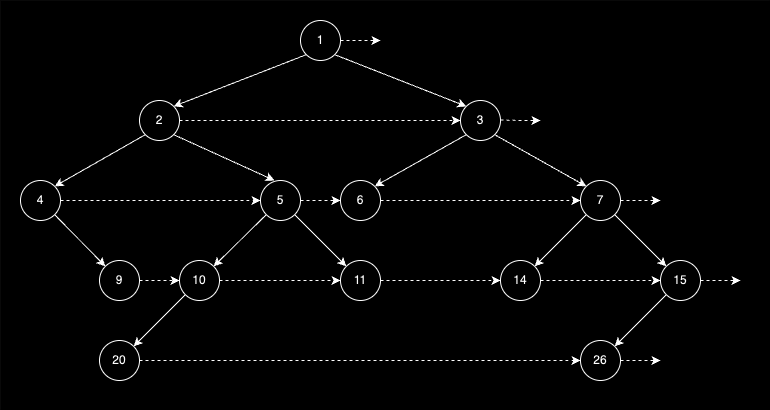

# Binary Tree

This repository contains a simple project that goes through an existing binary
tree and sets the peers to each node in the tree.



# Build

Generate the Make system using:

```
$> cmake -B ./build
```

With everything generated, you can then build the binary:

```
$> cmake --build ./build/
```
